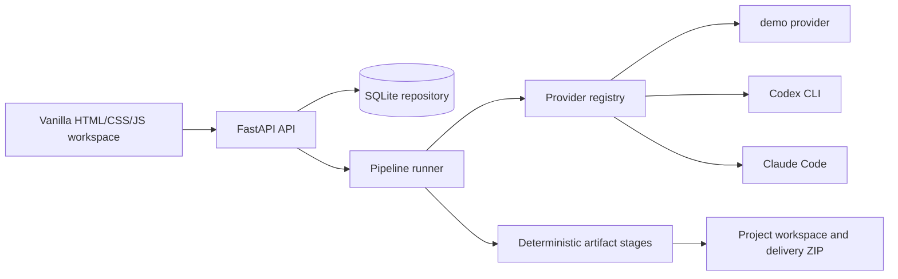

# Ebook Factory

AGPL-3.0-only local-first ebook production workspace. Ebook Factory runs a
bounded pipeline that creates strategy notes, research, outline, chapters,
cover assets, PDF/EPUB builds, marketing files, QA reports, and a delivery ZIP.

The default `demo` provider is deterministic and free. Operators can opt in per
project to their own local Codex CLI or Claude Code installation. Ebook Factory
does not store provider credentials.

## Screenshots


## Architecture



The provider protocol isolates agent execution from stage packaging. CLI
providers run with argv lists, `shell=False`, bounded timeout, project-local
working directory, captured logs, and output-file containment.

## Quick start

```bash
python -m venv .venv
.venv/bin/python -m pip install -e ".[dev]"
PYTHONPATH=src .venv/bin/python scripts/run_server.py --host 127.0.0.1 --port 8765 --data-dir data
```

Open `http://127.0.0.1:8765`.

Run tests:

```bash
PYTHONPATH=src .venv/bin/pytest -q
node --check src/ebook_factory/static/app.js
```

## Providers

`GET /api/providers` reports provider availability:

- `demo`: always available, deterministic, no paid service required.
- `codex-cli`: uses your local third-party Codex CLI installation.
- `claude-code`: uses your local third-party Claude Code installation.

Codex CLI and Claude Code are third-party tools. You are responsible for your
own subscriptions, logins, usage limits, and provider terms.

Optional executable overrides:

```bash
export EBOOK_FACTORY_CODEX_CLI=/path/to/codex
export EBOOK_FACTORY_CLAUDE_CODE=/path/to/claude
```

Provider credentials remain inside those tools. Ebook Factory only launches the
selected executable for the selected project.

## API

| Method | Path | Purpose |
| --- | --- | --- |
| GET | `/health` | Liveness check |
| GET | `/api/providers` | Provider labels and availability |
| POST | `/api/projects` | Create project, default provider `demo` |
| GET | `/api/projects` | List projects |
| GET | `/api/projects/{id}` | Detail with stages |
| POST | `/api/projects/{id}/start` | Start background pipeline |
| POST | `/api/projects/{id}/pause` | Pause after current stage |
| POST | `/api/projects/{id}/resume` | Resume paused project |
| POST | `/api/projects/{id}/cancel` | Cancel project |
| POST | `/api/projects/{id}/sources` | Upload `.txt`, `.md`, `.pdf` source files |
| GET | `/api/projects/{id}/events` | Event log |
| GET | `/api/projects/{id}/download` | Delivery ZIP |

Project modes: `lead-magnet`, `guide`, `premium`.
Providers: `demo`, `codex-cli`, `claude-code`.

## Security and privacy

- No credentials are stored by Ebook Factory.
- Source uploads are size-bounded, extension-checked, and filename-sanitized.
- Provider subprocesses run non-interactively inside the project workspace.
- Event logs record provider and stage status without storing full prompts or
  complete source material.
- Do not commit `.env`, `data/`, `projects/`, SQLite databases, generated
  ebooks, delivery ZIPs, virtualenvs, or provider credentials.

## AI disclosure

Ebook Factory is AI-assisted software. Generated materials require human review,
source verification, legal review where appropriate, and editorial approval
before publication or sale.

## Optional production helper

```bash
deploy/start-production.sh --host 127.0.0.1 --port 8765 --data-dir data
```

The Cloudflare tunnel helper is included for local review, but this repository
does not start persistent tunnels automatically.

## Project layout

```text
src/ebook_factory/       FastAPI app, provider adapters, pipeline, stages, UI
scripts/                 Server launcher and smoke E2E client
deploy/                  Local production helper scripts
docs/screenshots/        Public README screenshots
tests/                   Unit, API contract, provider, static UI, release tests
```

## License

AGPL-3.0-only. See [LICENSE](LICENSE).
