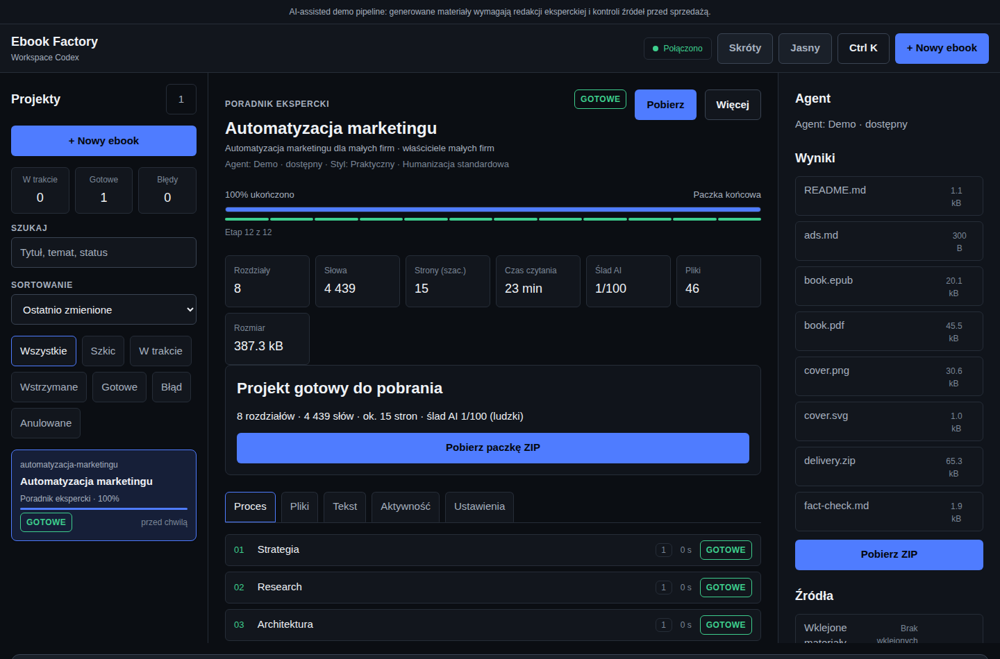
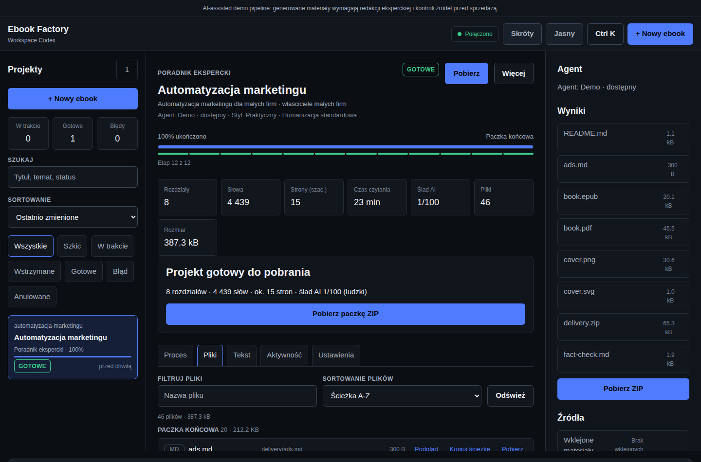
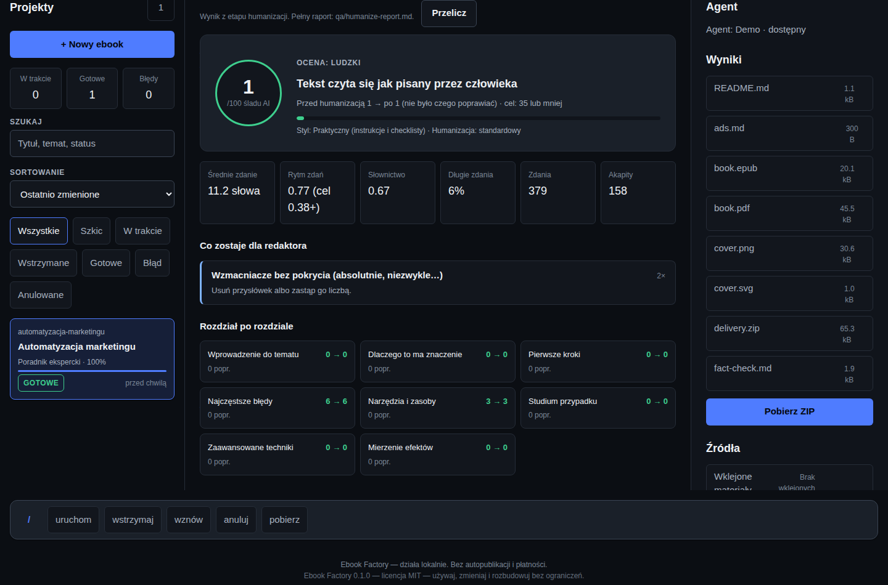
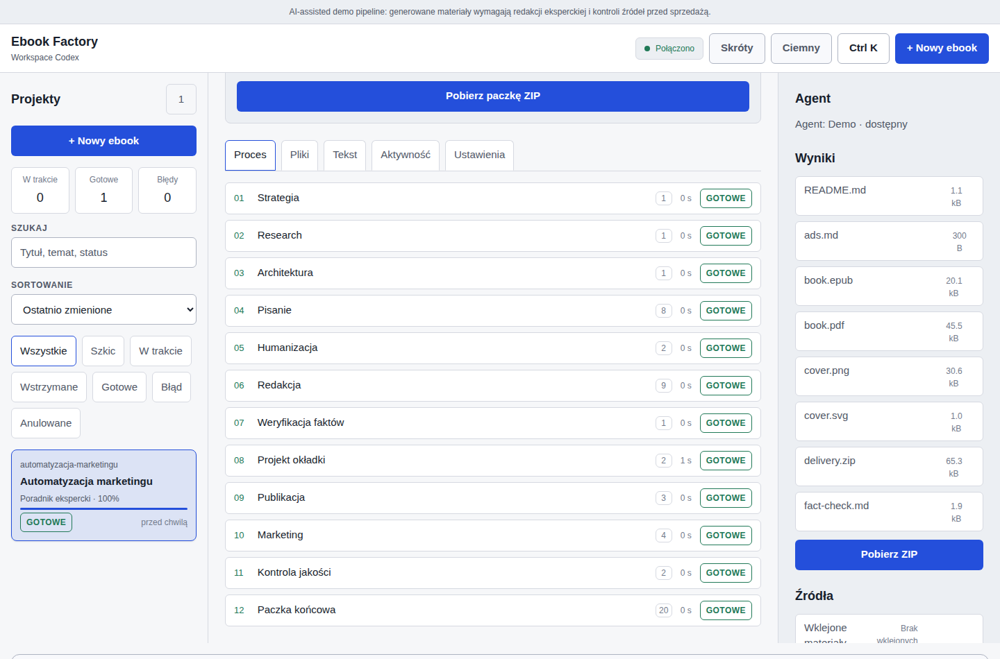
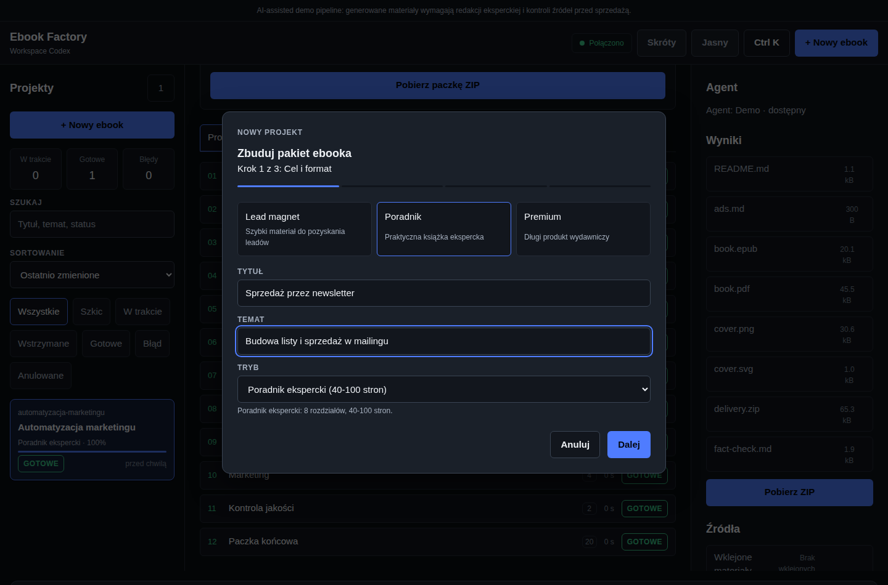
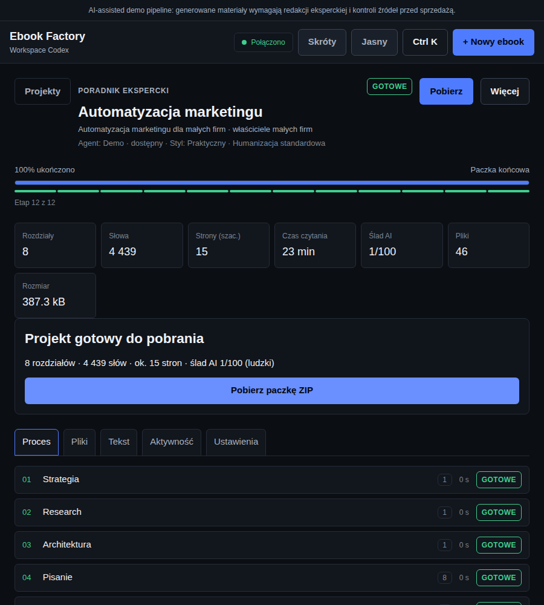
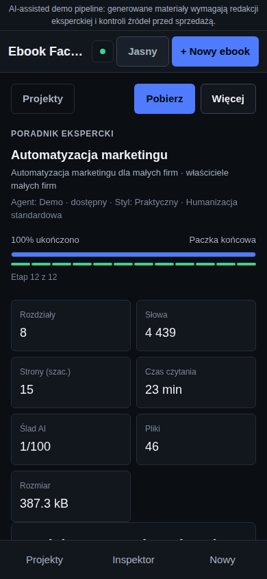
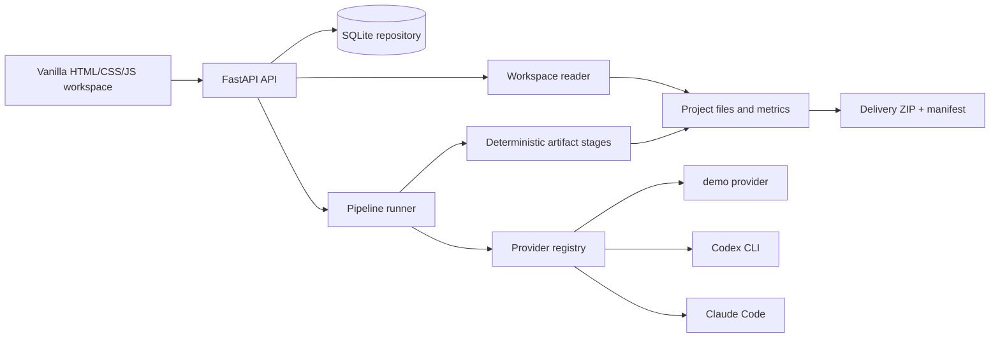

# Ebook Factory

**Lokalny warsztat produkcji ebooków.** Wpisujesz temat — dostajesz gotowy
pakiet wydawniczy: złożony PDF i EPUB ze stroną tytułową i spisem treści,
okładkę, manuskrypt w markdownie, materiały marketingowe, raport kontroli
jakości i paczkę ZIP z sumami kontrolnymi.

Wszystko działa na Twoim komputerze. Bez kont, bez płatnych API, bez wysyłania
treści na zewnątrz. Domyślny provider `demo` jest deterministyczny i darmowy;
per projekt możesz włączyć własną, lokalną instalację Codex CLI albo Claude
Code.

**Licencja MIT — rób z tym, co chcesz.** Używaj prywatnie i komercyjnie,
rozbudowuj, forkuj, zamykaj w swoim produkcie, sprzedawaj. Jedyny warunek:
zostaw notę o prawach autorskich.

> **Local-first, open source.** Ebook Factory nie przechowuje żadnych danych
> logowania do dostawców AI i nic nie publikuje automatycznie.

---

## Spis treści

- [Screenshots](#screenshots)
- [Co robi program](#co-robi-program)
- [Quick start](#quick-start)
- [Workflow: od pomysłu do paczki](#workflow-od-pomysłu-do-paczki)
- [Workspace UI](#workspace-ui)
- [Pipeline produkcyjny](#pipeline-produkcyjny)
- [Jak powstaje tekst (anty-AI-slop)](#jak-powstaje-tekst-anty-ai-slop)
- [Co zawiera gotowa paczka](#co-zawiera-gotowa-paczka)
- [Tryby projektu](#tryby-projektu)
- [Własna struktura rozdziałów](#własna-struktura-rozdziałów)
- [Materiały źródłowe](#materiały-źródłowe)
- [Providers](#providers)
- [Architecture](#architecture)
- [API](#api)
- [Konfiguracja](#konfiguracja)
- [Development](#development)
- [Security and privacy](#security-and-privacy)
- [AI disclosure](#ai-disclosure)
- [Optional production helper](#optional-production-helper)
- [Project layout](#project-layout)
- [Troubleshooting](#troubleshooting)
- [License](#license)

---

## Screenshots

**Workspace — proces, metryki i postęp w jednym widoku**



**Przeglądarka plików — każdy artefakt z podglądem i pobieraniem**



**Tekst — ślad AI, rytm zdań i lista poprawek rozdział po rozdziale**



**Motyw jasny i ciemny**



**Kreator nowego ebooka**



**Tablet i telefon**




---

## Co robi program

| Chcesz… | Ebook Factory robi to tak |
| --- | --- |
| Napisać ebooka od zera | 12-etapowy pipeline od strategii po paczkę ZIP |
| Narzucić własną strukturę | Podajesz listę rozdziałów, ona zastępuje preset trybu |
| Wykorzystać swoje materiały | Wklejasz tekst lub wgrywasz `.txt` / `.md` / `.pdf` |
| Dostać plik do druku i na czytnik | PDF (Typst, gdy dostępny) + EPUB 3 |
| Mieć okładkę | Generowana proceduralnie w PNG i SVG |
| Sprzedać produkt | Oferta, landing page, posty, warianty reklam |
| Tekst, który nie brzmi jak AI | Kompozytor prozy o zmiennym rytmie + osobny etap humanizacji |
| Wiedzieć, jak bardzo brzmi jak AI | Ślad AI 0-100, wskaźniki czytelności i lista poprawek w zakładce **Tekst** |
| Zweryfikować jakość | Automatyczne QA + lista twierdzeń do fact-checku |
| Przerwać i wrócić później | Pauza, wznowienie i ponowienie od miejsca błędu |
| Edytować treść ręcznie | Wszystko leży jako zwykłe pliki w workspace projektu |

---

## Quick start

```bash
python -m venv .venv
.venv/bin/python -m pip install -e ".[dev]"
PYTHONPATH=src .venv/bin/python scripts/run_server.py --host 127.0.0.1 --port 8765 --data-dir data
```

Otwórz `http://127.0.0.1:8765`, kliknij **+ Nowy ebook**, przejdź przez kreator
i zostaw zaznaczone „Uruchom produkcję od razu". Pierwsza paczka jest gotowa
w kilkanaście sekund.

Opcjonalnie: zainstaluj [Typst](https://typst.app), aby PDF-y powstawały
w jakości nadającej się do dalszej obróbki poligraficznej. Bez Typsta program
używa wbudowanego, bezzależnościowego generatora PDF i wyraźnie oznacza to
w raporcie QA.

---

## Workflow: od pomysłu do paczki

1. **Kreator (3 kroki + podsumowanie).** Cel i format → odbiorca, marka, styl
   pisania i poziom humanizacji → źródła i ustawienia → przegląd przed wysłaniem.
2. **Produkcja.** Pipeline przechodzi przez 12 etapów, zapisując stan po
   każdym z nich. Pasek postępu, etykieta bieżącego etapu i log zdarzeń
   aktualizują się na żywo.
3. **Kontrola.** W każdej chwili: **wstrzymaj** (po bieżącym etapie),
   **wznów**, **anuluj**. Po błędzie — **ponów od błędu**: ukończone etapy
   zachowują swoje artefakty, ponawiany jest tylko pierwszy nieukończony etap
   i wszystko po nim.
4. **Przegląd.** Zakładka **Pliki** pokazuje każdy realny plik w workspace,
   pogrupowany według etapu, z podglądem tekstu i obrazów oraz pobieraniem.
5. **Iteracja.** Zakładka **Ustawienia** pozwala zmienić tytuł, temat, tryb,
   odbiorcę, ton, styl pisania, poziom humanizacji i strukturę rozdziałów —
   a potem uruchomić produkcję ponownie.
   **Duplikuj projekt** klonuje same ustawienia, bez artefaktów, na kolejny
   wariant.
6. **Dostawa.** Po ukończeniu: jeden przycisk, jedna paczka ZIP z manifestem
   SHA-256.

---

## Workspace UI

Interfejs to czysty HTML/CSS/JS — bez frameworka, bez CDN, bez webfontów.
Działa na desktopie, tablecie i telefonie.

**Nawigacja i przegląd**

- Lista projektów z wyszukiwarką, filtrami statusu i sortowaniem
  (ostatnio zmienione / najnowsze / tytuł / postęp).
- Liczniki portfela: w trakcie, gotowe, błędy.
- Pasek metryk materiału: rozdziały, słowa, szacowane strony, czas czytania,
  liczba plików, rozmiar workspace i ślad AI — liczone z plików na dysku, więc
  pozostają prawdziwe także po wznowieniu i po ręcznej edycji rozdziału.

**Praca z projektem**

- **Proces** — oś 12 etapów; każdy rozwijany: czas trwania, liczba prób,
  znaczniki startu i końca, komunikat oraz lista wytworzonych artefaktów
  (klikalna, otwiera podgląd). Nad osią pasek etapów pokazuje stan całego
  przebiegu, a licznik podaje bieżący etap, czas jego trwania i szacowany
  czas do końca liczony z rzeczywistych czasów ukończonych etapów.
- **Pliki** — przeglądarka workspace z filtrem po nazwie, sortowaniem
  (ścieżka / nazwa / rozmiar / data), podziałem na kategorie, sumą rozmiaru
  w każdej grupie, znacznikiem formatu, kopiowaniem ścieżki, podglądem
  tekstu, obrazów i PDF oraz pobieraniem pojedynczych plików.
- **Tekst** — ocena tego, jak bardzo materiał brzmi jak napisany przez
  maszynę: ślad AI w skali 0-100 (0 = tekst ludzki), ocena słowna, porównanie
  przed i po humanizacji, wskaźniki czytelności (średnia długość zdania,
  zróżnicowanie rytmu, bogactwo słownictwa, udział zdań-molochów), lista
  wykrytych śladów z podpowiedzią co z nimi zrobić oraz wynik rozdział po
  rozdziale. Przycisk **Przelicz** liczy wszystko od nowa z plików na dysku.
- **Aktywność** — log zdarzeń z wyszukiwarką treści, filtrem poziomu
  (informacje / błędy), pełnym znacznikiem czasu pod kursorem oraz
  kopiowaniem i pobieraniem logu jako pliku tekstowego.
- **Ustawienia** — edycja projektu (`PATCH`), blokowana w trakcie produkcji.
  Niezapisane zmiany są oznaczane, można je cofnąć przyciskiem **Przywróć**,
  a przejście na inny projekt lub zamknięcie karty wymaga potwierdzenia.
- **Inspektor** — status agenta, wyniki, źródła (z wgrywaniem plików w locie)
  i ostatnia aktywność.

**Sterowanie**

- Paleta komend: `Ctrl`/`Cmd` + `K`. Pokazuje tylko komendy dopuszczalne dla
  bieżącego stanu projektu; pozostałe są wyszarzone wraz z powodem.
- Skróty: `n` — nowy ebook, `/` — wyszukiwarka, `1`–`4` — przełączanie
  zakładek, `r` — odświeżenie danych, `?` — spis skrótów, `↑`/`↓` — ruch po
  liście projektów.
- Pasek szybkich komend: uruchom / wstrzymaj / wznów / anuluj / pobierz.
- Menu **Więcej**: ponów od błędu, edytuj ustawienia, duplikuj, usuń
  (usunięcie wymaga potwierdzenia i kasuje także pliki projektu).
- Przełącznik motywu jasny/ciemny oraz filtry, sortowania i tryb zawijania
  podglądu — zapamiętywane w przeglądarce.

**Stan i odświeżanie**

- Wskaźnik połączenia w nagłówku: połączono / serwer nie odpowiada / brak
  połączenia, z czasem ostatniej synchronizacji w podpowiedzi.
- Odpytywanie API dopasowuje się do stanu projektu (szybciej w trakcie
  produkcji), zatrzymuje się na nieaktywnej karcie i nigdy nie nakłada na
  siebie dwóch żądań.
- Czasy trwania i znaczniki „przed chwilą” odliczają lokalnie, bez dodatkowego
  ruchu sieciowego; tytuł karty przeglądarki pokazuje postęp produkcji.
- Przyciski akcji blokują się na czas żądania, więc podwójne kliknięcie nie
  wyśle dwóch komend.

**Dostępność i responsywność**

- Widoczny focus ring, `prefers-reduced-motion`, skip link, etykiety dla
  wszystkich pól, role ARIA na zakładkach, dialogach i palecie.
- Odświeżenie listy w tle nie zabiera focusu — po ponownym renderze wraca on
  na ten sam projekt lub etap.
- Status nigdy nie jest sygnalizowany samym kolorem: każdy chip, pasek etapów
  i wskaźnik połączenia mają czytelną etykietę.
- Poniżej 768 px lista projektów staje się szufladą, inspektor — dolnym
  arkuszem, a główna akcja przykleja się do dołu ekranu.

---

## Pipeline produkcyjny

Każdy etap ma sygnaturę `(project, project_dir) -> StageResult` i zapisuje
prawdziwe pliki na dysku. Stan trafia do SQLite po każdym etapie, więc świeży
proces może kontynuować od miejsca przerwania.

| # | Etap | Co powstaje |
| --- | --- | --- |
| 1 | `strategy` | `outline/strategy.md` — obietnica, pozycjonowanie, zakres |
| 2 | `research` | `research/notes.md` — ślad źródeł do weryfikacji |
| 3 | `outline` | `outline/outline.json` — struktura rozdziałów |
| 4 | `draft` | `chapters/chapter-NN.md` — pierwsza wersja treści |
| 5 | `humanize` | przepisane rozdziały + `qa/humanize-report.md`, `qa/humanize.json` |
| 6 | `edit` | `builds/manuscript.md` — scalony manuskrypt ze wstępem |
| 7 | `fact_check` | `qa/fact-check.md` — twierdzenia do potwierdzenia |
| 8 | `design` | `images/cover.png`, `images/cover.svg` |
| 9 | `publish` | `builds/book.pdf`, `builds/book.epub`, `qa/engine.json` |
| 10 | `marketing` | `marketing/offer.md`, `landing.html`, `posts.md`, `ads.md` |
| 11 | `qa` | `qa/qa-report.md`, `qa/metrics.json` |
| 12 | `delivery` | `delivery/` + `delivery.zip` + `manifest.json` |

Etap, który się nie powiedzie, jest ponawiany do trzech razy w obrębie jednego
przebiegu. Dopiero potem projekt przechodzi w stan `failed` — i wtedy pomaga
**ponów od błędu**.

**Kontrole QA** obejmują: liczbę stron i obecność tekstu w PDF, poprawność
struktury ZIP w EPUB, meta viewport i CTA na landingu, zgodność liczby
rozdziałów z outline'em, brak znaczników roboczych (TODO/LOREM) oraz metryki
materiału. Raport wyraźnie rozróżnia PDF złożony Typstem od pliku z generatora
awaryjnego.

Do tego dochodzą dwie kontrole **redakcyjne**: ślad AI w tekście i
zróżnicowanie rytmu zdań. Są oznaczane jako `UWAGA`, a nie `FAIL` — niska
ocena czytelności to uwaga dla redaktora, nie powód, żeby wyrzucić gotową
paczkę.

---

## Jak powstaje tekst (anty-AI-slop)

Tekst, który brzmi jak wygenerowany, nie sprzedaje się i nie czyta. Dlatego
pisanie i redakcja są tu rozbite na dwa osobne kroki: **kompozytor prozy**
(`prose.py`) i **humanizator** (`humanize.py`).

### Kompozytor prozy — rozdział o zmiennym kształcie

Poprzednia wersja generatora krążyła po dwunastu zdaniach do wyczerpania limitu
słów. Każdy rozdział miał ten sam rytm, ten sam początek i ten sam kształt.

Teraz rozdział jest **komponowany**:

- **otwarcie** losowane z kilku kształtów — scena, mocna teza, pytanie
  czytelnika, typowy błąd, liczba — nigdy dwa razy to samo pod rząd;
- **sekcje** mierzone w słowach (~210), a nie liczone — sekcja krótsza od tego
  zamienia rozdział w listę nagłówków, którą czytelnik przewija;
- **bloki o różnym kształcie**: proza, kroki numerowane, wypunktowania,
  przykład z praktyki, cytat na marginesie, para „działa / nie działa”,
  pytanie z odpowiedzią, lista kontrolna;
- **rytm zdań** planowany z góry: krótkie uderzenia (3-6 słów) przeplatane
  długimi, bo równa długość zdań to najmocniejszy statystyczny ślad maszyny;
- **zamknięcie**: trzy konkretne zadania do odhaczenia i jedno zdanie wniosku.

Kompozytor pamięta, czego już użył — **w obrębie całej książki**, nie tylko
rozdziału — więc rozdział dziewiąty nie powtarza rozdziału drugiego.
Wszystko jest deterministyczne: ten sam projekt zawsze daje tę samą książkę,
więc wznowienie przebiegu nie przepisuje historii.

**Styl pisania** wybierasz w kreatorze i w ustawieniach:

| Styl | Z czego zbudowane są rozdziały |
| --- | --- |
| `practical` | instrukcje, kroki, listy kontrolne |
| `narrative` | historie, sceny, przykłady z praktyki |
| `expert` | analiza, dowody, kontrargumenty, warunki brzegowe |

### Humanizator — osobny etap produkcji

Etap `humanize` czyta gotowe rozdziały, **wykrywa** ślady maszynowego pisania
i **przepisuje** to, co da się przepisać bezpiecznie. Nigdy nie dopisuje
twierdzeń — nie może, bo nie ma czym ich sprawdzić — więc tekst po humanizacji
jest dokładnie tak samo prawdziwy jak przed nią.

**Co wykrywa** (każdy sygnał ma wagę i składa się na ślad AI w skali 0-100):

| Sygnał | Przykład |
| --- | --- |
| zwroty-wytrychy | „w dzisiejszych czasach”, „warto pamiętać, że”, „kompleksowe rozwiązania”, „delve into” |
| wata na początku zdania | „Oczywiście,”, „Można powiedzieć, że”, „Jak się okazuje,” |
| stos łączników | co drugi akapit od „Ponadto”, „Co więcej”, „W konsekwencji” |
| nadmiar myślników | więcej niż 4 na 1000 słów |
| konstrukcja „nie X, tylko Y” | „nie chodzi o narzędzia, chodzi o nawyki” |
| wyliczenia po trzy | „dane, procesy i ludzie” w każdym akapicie |
| asekuracja i wzmacniacze | „raczej”, „zazwyczaj” / „absolutnie”, „niezwykle” |
| równy rytm zdań | zróżnicowanie długości poniżej 0.38 |
| akapity równej długości | zróżnicowanie poniżej 0.32 |
| powtarzane początki zdań | próg skaluje się z długością tekstu |
| ubogie słownictwo | miara MATTR, niezależna od długości książki |
| zdania-molochy, wykrzykniki, emoji, nagłówki Wielkimi Literami | |

**Co przepisuje** — zależnie od poziomu:

| Poziom | Co robi |
| --- | --- |
| `off` | tylko ocena, tekst zostaje nietknięty |
| `light` | zwroty-wytrychy, emoji, nadmiar wykrzykników |
| `standard` | dodatkowo wata, stos łączników, myślniki, zdania-molochy |
| `strong` | dodatkowo rytm akapitu, powtarzane początki, wzmacniacze, węższy limit długości zdania |

Podmiany są odporne na polską fleksję: przymiotnik jest usuwany w całości albo
zamieniany na przymiotnik o tej samej końcówce, a zamiany zmieniające rodzaj
rzeczownika zostały świadomie wycięte, żeby nie rozjechać zgody z przydawką.
Struktura markdown (nagłówki, listy, cytaty, bloki kodu) przechodzi bez zmian,
a wypunktowanie zapisane małą literą zostaje małą literą.

Etap zapisuje `qa/humanize-report.md` (dla człowieka) i `qa/humanize.json`
(dla UI i API): ocena przed i po, wskaźniki czytelności, lista wykonanych
poprawek i lista rzeczy, które musi ocenić redaktor — rozdział po rozdziale.

**Co zostaje dla człowieka.** Humanizator nie naprawia konstrukcji „nie X,
tylko Y”, nie zmienia szyku zdania i nie wstawia przykładów z życia. Zgłasza
je w raporcie z podpowiedzią, co zrobić — bo to jest praca redaktora, a nie
wyrażenia regularnego.

## Co zawiera gotowa paczka

```text
delivery.zip
├── book.pdf            złożona książka ze stroną tytułową, spisem treści i notą
├── book.epub           EPUB 3 do czytników
├── manuscript.md       pełny manuskrypt do dalszej redakcji
├── outline.json        struktura rozdziałów użyta przy pisaniu
├── strategy.md         notatka strategiczna
├── research-notes.md   ślad researchu
├── fact-check.md       lista twierdzeń do potwierdzenia źródłami
├── humanize-report.md  ślad AI, rytm zdań i lista wykonanych poprawek
├── humanize.json       ten sam raport w formie danych
├── cover.png           okładka rastrowa
├── cover.svg           okładka wektorowa
├── offer.md            opis oferty
├── landing.html        gotowa strona sprzedażowa
├── posts.md            posty organiczne
├── ads.md              warianty reklam
├── qa-report.md        raport kontroli jakości
├── metrics.json        metryki materiału
├── README.md           przewodnik po paczce i checklista przed publikacją
└── manifest.json       SHA-256 każdego pliku
```

---

## Tryby projektu

| Tryb | Etykieta | Rozdziały | Stron | Zastosowanie |
| --- | --- | --- | --- | --- |
| `lead-magnet` | Lead magnet | 5 | 15-30 | Materiał do pozyskiwania leadów |
| `guide` | Poradnik ekspercki | 8 | 40-100 | Praktyczna książka ekspercka |
| `premium` | Książka premium | 14 | 150-300 | Długi produkt wydawniczy |

---

## Własna struktura rozdziałów

Tryb ustala domyślną strukturę, ale możesz ją nadpisać — w kreatorze
(pole „Własna struktura rozdziałów") albo później w zakładce **Ustawienia**.
Jeden tytuł w wierszu:

```text
Dlaczego teraz
Pierwszy proces do zautomatyzowania
Wybór narzędzi
Pomiar efektów
```

Podane tytuły są przycinane, odfiltrowywane z duplikatów (bez względu na
wielkość liter) i decydują o liczbie rozdziałów. Kontrola QA sprawdza liczbę
rozdziałów względem Twojego outline'u, a nie presetu trybu. Przez API to pole
`chapter_titles` (maks. 40 pozycji po 160 znaków).

---

## Materiały źródłowe

Dwie drogi, obie opcjonalne:

- **Wklejony tekst** — pole w kreatorze, do 50 000 znaków.
- **Pliki** — `.txt`, `.md`, `.pdf`, maks. 5 MB na plik i 5 plików na projekt.
  Wgrywasz je w kreatorze albo później w inspektorze.

Tekst z plików jest wyciągany i dopisywany do materiałów projektu (`.pdf`
wymaga `pdftotext`; bez niego plik zostaje zapisany, a status ekstrakcji to
`unavailable`). Etapy `strategy` i `research` korzystają z tych materiałów.

Walidacja sprawdza zawartość, nie tylko nazwę pliku: rozszerzenie, rozmiar,
sygnaturę PDF i poprawność UTF-8. Nazwy plików są sanityzowane do płaskiej
postaci, więc `../../etc/passwd` nigdy nie wyjdzie poza katalog `sources`.

---

## Providers

`GET /api/providers` raportuje dostępność:

- `demo` — zawsze dostępny, deterministyczny, bez płatnych usług.
- `codex-cli` — używa Twojej lokalnej instalacji Codex CLI.
- `claude-code` — używa Twojej lokalnej instalacji Claude Code.

Codex CLI i Claude Code to narzędzia third-party. Odpowiadasz za własne
subskrypcje, logowanie, limity użycia i warunki dostawcy. Niedostępne lokalnie
providery są w UI wyszarzone.

> Codex CLI and Claude Code are third-party tools. You are responsible for your
> own subscription, login, usage limits, and provider terms. Ebook Factory
> stores no provider credentials.

Opcjonalne nadpisanie ścieżek:

```bash
export EBOOK_FACTORY_CODEX_CLI=/path/to/codex
export EBOOK_FACTORY_CLAUDE_CODE=/path/to/claude
```

Dane logowania zostają wewnątrz tych narzędzi. Ebook Factory uruchamia tylko
wskazany plik wykonywalny dla wskazanego projektu — z listą argumentów,
`shell=False`, limitem czasu, katalogiem roboczym projektu, przechwyconymi
logami i kontrolą pliku wyjściowego.

---

## Architecture



Warstwy są rozdzielone celowo: protokół providera izoluje wykonanie agenta od
pakowania artefaktów, a moduł `workspace` czyta dysk tylko do odczytu, więc UI
pokazuje faktyczny stan produkcji zamiast go zgadywać.

---

## API

### Projekty

| Method | Path | Purpose |
| --- | --- | --- |
| GET | `/health` | Liveness check |
| GET | `/api/version` | Build identity: wersja, licencja, tryby, providerzy |
| GET | `/api/providers` | Provider labels and availability |
| GET | `/api/stats` | Portfolio counters by status |
| POST | `/api/projects` | Create project, default provider `demo` |
| GET | `/api/projects` | List projects |
| GET | `/api/projects/{id}` | Detail with stages |
| PATCH | `/api/projects/{id}` | Update settings (409 while running) |
| DELETE | `/api/projects/{id}` | Delete project rows and workspace |
| POST | `/api/projects/{id}/duplicate` | Clone settings into a new draft |

### Sterowanie pipeline'em

| Method | Path | Purpose |
| --- | --- | --- |
| POST | `/api/projects/{id}/start` | Start background pipeline |
| POST | `/api/projects/{id}/pause` | Pause after current stage |
| POST | `/api/projects/{id}/resume` | Resume paused project |
| POST | `/api/projects/{id}/retry` | Replay from the first unfinished stage |
| POST | `/api/projects/{id}/cancel` | Cancel project |

### Zachowanie przy błędach

Pipeline nigdy nie zostawia projektu w stanie, z którego nie da się wyjść:

| Sytuacja | Co robi program |
| --- | --- |
| Etap kończy się błędem | Do `MAX_STAGE_ATTEMPTS` prób, potem `failed` z komunikatem etapu |
| Worker rzuci nieoczekiwany wyjątek | Projekt dostaje status `failed` i wpis w logu — nie zawiesza się na `running` |
| Projekt wskazuje nieznanego providera | Czysty `failed` z nazwą providera, bez wywracania wątku |
| Brakuje plików wejściowych do paczki | `delivery` mówi, których plików brakuje, zamiast rzucać `FileNotFoundError` |
| Upload większy niż limit | Odrzucony po przeczytaniu limitu + 1 bajt, reszta nigdy nie trafia do pamięci |

Po każdym z tych stanów `POST /api/projects/{id}/retry` wznawia pracę od
pierwszego niedokończonego etapu; ukończone etapy zachowują swoje artefakty.

### Treść i artefakty

| Method | Path | Purpose |
| --- | --- | --- |
| POST | `/api/projects/{id}/sources` | Upload `.txt`, `.md`, `.pdf` source files (409 while running) |
| GET | `/api/projects/{id}/events` | Event log (`after_id`, `limit`) |
| GET | `/api/projects/{id}/artifacts` | Workspace files grouped by category |
| GET | `/api/projects/{id}/artifacts/preview?path=` | Bounded UTF-8 text preview |
| GET | `/api/projects/{id}/artifacts/raw?path=` | Serve one artifact |
| GET | `/api/projects/{id}/metrics` | Words, pages, chapters, reading time, ślad AI |
| GET | `/api/projects/{id}/readability` | Ślad AI, wskaźniki czytelności i wykryte sygnały |
| GET | `/api/projects/{id}/download` | Delivery ZIP |

Project modes: `lead-magnet`, `guide`, `premium`.
Providers: `demo`, `codex-cli`, `claude-code`.
Style pisania: `practical`, `narrative`, `expert` (domyślnie `practical`).
Poziomy humanizacji: `off`, `light`, `standard`, `strong` (domyślnie `standard`).
Statusy: `draft`, `running`, `paused`, `completed`, `failed`, `cancelled`.

### Przykład

```bash
BASE=http://127.0.0.1:8765

ID=$(curl -s -X POST $BASE/api/projects -H 'Content-Type: application/json' -d '{
  "title": "Automatyzacja w małej firmie",
  "topic": "Jak wdrożyć AI w codziennej pracy",
  "mode": "guide",
  "audience": "właściciele małych firm",
  "writing_style": "practical",
  "humanize_level": "standard",
  "chapter_titles": ["Dlaczego teraz", "Pierwszy proces", "Narzędzia", "Pomiar efektów"]
}' | python3 -c 'import json,sys; print(json.load(sys.stdin)["id"])')

curl -s -X POST $BASE/api/projects/$ID/start
curl -s $BASE/api/projects/$ID/metrics
curl -s $BASE/api/projects/$ID/readability
curl -s $BASE/api/projects/$ID/artifacts
curl -sL -o delivery.zip $BASE/api/projects/$ID/download
```

---

## Konfiguracja

Skopiuj `.env.example` do `.env` i dostosuj. Zmienne środowiskowe:

| Zmienna | Znaczenie |
| --- | --- |
| `EBOOK_FACTORY_DATA_DIR` | Katalog danych dla `main.py` (domyślnie `.data`) |
| `EBOOK_FACTORY_AUTH_USER` | Włącza HTTP Basic Auth (razem z hasłem) |
| `EBOOK_FACTORY_AUTH_PASSWORD` | Hasło do Basic Auth |
| `EBOOK_FACTORY_CODEX_CLI` | Ścieżka do binarki Codex CLI |
| `EBOOK_FACTORY_CLAUDE_CODE` | Ścieżka do binarki Claude Code |

Basic Auth włącza się tylko wtedy, gdy ustawione są obie zmienne. Przy
wystawianiu instancji poza `127.0.0.1` ustaw je zawsze.

---

## Development

```bash
PYTHONPATH=src .venv/bin/pytest -q
node --check src/ebook_factory/static/app.js
```

Testy pokrywają: model domenowy, repozytorium SQLite, pipeline i wznawianie,
etapy i artefakty, kontrakt API (również ścieżki artefaktów i traversal),
providery, upload źródeł, warstwę workspace, statyczne UI oraz higienę
wydania. Pełny przebieg E2E buduje prawdziwą paczkę i weryfikuje jej ZIP.

Smoke test przez HTTP:

```bash
PYTHONPATH=src .venv/bin/python scripts/smoke_e2e.py --base-url http://127.0.0.1:8765
```

Screenshoty w `docs/screenshots` odtwarza jedno polecenie: skrypt startuje
aplikację na katalogu tymczasowym, produkuje demo ebooka i zapisuje ujęcia dla
desktopu, tabletu i telefonu.

```bash
pip install playwright && playwright install chromium
python scripts/capture_screenshots.py
```

Zasady contributingu: [CONTRIBUTING.md](CONTRIBUTING.md).
Zgłaszanie podatności: [SECURITY.md](SECURITY.md).

---

## Security and privacy

- Ebook Factory nie przechowuje żadnych danych logowania.
- Uploady źródeł są ograniczone rozmiarem, walidowane po zawartości
  i sanityzowane po nazwie.
- Ścieżki artefaktów są rozwiązywane względem katalogu projektu; przejścia
  w górę drzewa, ścieżki absolutne i dowiązania wychodzące poza workspace są
  odrzucane, a dowiązania pomijane na listingu.
- Wygenerowany HTML i SVG nigdy nie są serwowane inline — tylko jako
  załącznik, z `X-Content-Type-Options: nosniff` i restrykcyjnym CSP, więc
  treść z workspace nie wykona się w originie aplikacji.
- Podglądy tekstu są ograniczone rozmiarem i nie wczytują całych plików.
- Subprocesy providerów działają nieinteraktywnie, w katalogu projektu,
  z limitem czasu i bez powłoki.
- Log zdarzeń zapisuje provider i status etapu — bez pełnych promptów
  i bez kompletnych materiałów źródłowych.
- Nie commituj: `.env`, `data/`, `projects/`, baz SQLite, wygenerowanych
  ebooków, paczek ZIP, virtualenvów i danych logowania providerów.

---

## AI disclosure

Ebook Factory to oprogramowanie wspierane przez AI. Wygenerowane materiały
wymagają redakcji przez człowieka, weryfikacji źródeł, w razie potrzeby
przeglądu prawnego i akceptacji redakcyjnej przed publikacją lub sprzedażą.
Provider `demo` tworzy treść demonstracyjną: struktura, proces i sposób
pisania są prawdziwe, ale materiał nie zawiera wiedzy eksperckiej ani
zweryfikowanych źródeł. Humanizator poprawia to, *jak* tekst brzmi — nigdy to,
*co* mówi: nie dopisuje twierdzeń i nie zmienia faktów, więc niski ślad AI nie
oznacza, że treść jest prawdziwa. Każda paczka niesie tę informację w nocie
w książce i w `README.md` paczki.

---

## Optional production helper

```bash
deploy/start-production.sh --host 127.0.0.1 --port 8765 --data-dir data
```

Helper tunelu Cloudflare jest dołączony do lokalnych przeglądów, ale to
repozytorium nie uruchamia trwałych tuneli automatycznie.

---

## Project layout

```text
src/ebook_factory/
├── api.py          Routing HTTP i rejestr workerów
├── app.py          Application factory
├── models.py       Model domenowy, tryby, definicje etapów
├── repository.py   Persystencja SQLite i migracje
├── pipeline.py     Wznawialny runner etapów
├── stages.py       Handlery 12 etapów produkcji
├── prose.py        Kompozytor rozdziałów (struktura, rytm, warianty)
├── humanize.py     Detektor i korektor śladów AI w tekście
├── artifacts.py    EPUB, PDF, okładka, manifest, ZIP
├── workspace.py    Odczyt artefaktów, bezpieczne ścieżki, metryki
├── providers.py    Rejestr i adaptery providerów
├── sources.py      Walidacja i zapis materiałów źródłowych
├── pdfcheck.py     Kontrola PDF na potrzeby QA
└── static/         Workspace UI (HTML, CSS, JS, favicon)

scripts/            Launcher serwera, smoke E2E i generator screenshotów
deploy/             Lokalne helpery produkcyjne
docs/               Specyfikacje, plany i screenshoty
tests/              Testy jednostkowe, API, providerów, UI i wydania
```

Dane działającej instancji (`data/`, `projects/`, `factory.db`) są ignorowane
przez gita.

---

## Troubleshooting

| Objaw | Przyczyna i rozwiązanie |
| --- | --- |
| Raport QA mówi o „silniku awaryjnym" | Brak Typsta w `PATH` lub `~/.local/bin`. Zainstaluj Typst i uruchom ponownie. |
| Provider wyszarzony w kreatorze | Binarka nieznaleziona. Ustaw `EBOOK_FACTORY_CODEX_CLI` lub `EBOOK_FACTORY_CLAUDE_CODE`. |
| PDF wgrany jako źródło bez tekstu | Brak `pdftotext` (pakiet poppler-utils). Plik zapisze się, ale bez ekstrakcji. |
| `409 project is already running` | Worker wciąż żyje — wstrzymaj albo poczekaj na koniec etapu. |
| `409 cannot edit a project while it is running` | Zmiany ustawień wymagają zatrzymanego projektu. |
| Pobieranie zwraca 404 | Paczka powstaje dopiero po etapie `delivery`. |

---

## License

**MIT.** Zobacz [LICENSE](LICENSE).

Możesz bez pytania:

- używać programu prywatnie i komercyjnie,
- zmieniać kod i rozbudowywać go o własne etapy, providerów i formaty,
- forkować, redystrybuować i sprzedawać — także jako część zamkniętego produktu,
- publikować i sprzedawać ebooki wyprodukowane tym narzędziem.

Jedyny warunek MIT: zachowaj notę o prawach autorskich i treść licencji
w kopiach lub istotnych fragmentach oprogramowania. Program jest dostarczany
„AS IS”, bez gwarancji.

> Projekt był wcześniej wydany na AGPL-3.0-only. Od tej zmiany obowiązuje MIT,
> licencja maksymalnie permisywna, żeby nikt nie miał wątpliwości, czy wolno mu
> tego użyć i to rozbudować.

Treść wygenerowana przez pipeline należy do Ciebie — Ebook Factory nie rości
sobie do niej żadnych praw. Odpowiadasz za prawa do własnych materiałów
źródłowych i za weryfikację treści przed publikacją.
